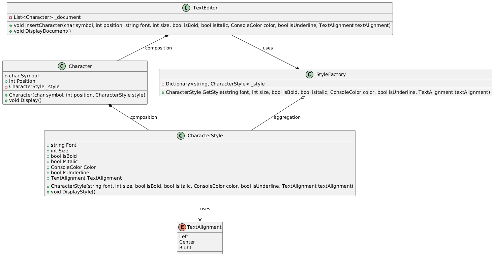

**Text Editor Using the Flyweight Design Pattern**

**Overview**
This project demonstrates the implementation of the Flyweight design pattern through a simple text editor application. The Flyweight pattern is a structural design pattern used to minimize memory usage by sharing as much data as possible with similar objects. In the context of this text editor, the pattern helps efficiently manage and render text with different styles.

**Design Principle: The Flyweight Pattern**
The Flyweight design pattern is focused on reducing the number of objects created and minimizing memory usage by sharing common parts of the object state. It divides the object state into intrinsic and extrinsic properties:

**Intrinsic Properties:** These are the properties that are shared among many objects. For instance, font type, size, and style (bold, italic) in a text editor can be considered intrinsic because multiple characters might share the same style.

**Extrinsic Properties:** These are unique to each object and are provided by the client. In our text editor example, the character symbol and its position in the document are extrinsic.

By separating the intrinsic state (shared data) from the extrinsic state (unique data), the Flyweight pattern allows multiple characters to share the same style information, which significantly reduces memory usage.

**Classes Involved in Implementaion**
1. CharacterStyle
Description: Represents the style of a character, including font, size, bold, italic, color, underline, and text alignment.
Role in Flyweight: This class serves as the Flyweight in our pattern. Instances of CharacterStyle are shared among multiple Character objects to minimize memory usage.
2. Character
Description: Represents a character in the text editor, holding the symbol, position, and a reference to a CharacterStyle.
Role in Flyweight: This class contains the extrinsic state (symbol and position) and references the intrinsic state (style) from the CharacterStyle object.
3. StyleFactory
Description: Manages the creation and retrieval of CharacterStyle objects. It ensures that only one instance of each style is created and shared among multiple characters.
Role in Flyweight: This class implements the factory method to return shared CharacterStyle objects, ensuring that identical styles are reused.
4. TextEditor
Description: Manages a collection of Character objects, allowing insertion of characters and displaying the document.
Role in Flyweight: This class acts as the client, utilizing the StyleFactory to create or retrieve CharacterStyle objects and manage Character instances.
5. Unit Tests
Description: The FlyweightTests class contains unit tests to verify the functionality and efficiency of the Flyweight implementation. It ensures that styles are shared where appropriate and that characters are correctly instantiated and managed.

**Functions and Features**
1. InsertCharacter (TextEditor)
Purpose: Allows inserting a character with specific style properties at a given position in the document.
How it Works: This method uses the StyleFactory to get the appropriate CharacterStyle object based on the provided properties. If an identical style already exists, it will reuse that instance; otherwise, a new one is created.
2. GetStyle (StyleFactory)
Purpose: Retrieves a shared CharacterStyle object or creates a new one if it doesn't exist.
How it Works: The method checks if a style with the given properties already exists in the dictionary. If it does, it returns the existing style; if not, it creates and stores a new one.
3. DisplayDocument (TextEditor)
Purpose: Displays the entire document by printing each character along with its style to the console.
How it Works: This method iterates through the list of Character objects, calling their Display method to output the character's symbol and style.
4. Display (Character)
Purpose: Displays a character’s symbol with the applied style.
How it Works: This method sets the console's text formatting based on the character's style and prints the character.
5. DisplayStyle (CharacterStyle)
Purpose: Outputs the style properties of a character.
How it Works: This method prints the style properties like font, size, and color to the console.
Example of Flyweight Implementation
In the text editor, consider you have multiple characters with similar formatting (e.g., all are bold and in Arial font). Instead of creating a unique style object for each character, the Flyweight pattern allows these characters to share a single CharacterStyle instance. For example, if you insert two characters, 'A' and 'B', both with the Arial font, size 12, and bold formatting, they will both reference the same CharacterStyle object, saving memory and improving performance.

**Class Diagram:**

**Conclusion**
This project effectively demonstrates the Flyweight design pattern through a simple yet functional text editor application. By separating shared properties (styles) from unique properties (character symbol and position), the Flyweight pattern ensures that memory usage is minimized, even when dealing with large documents.

